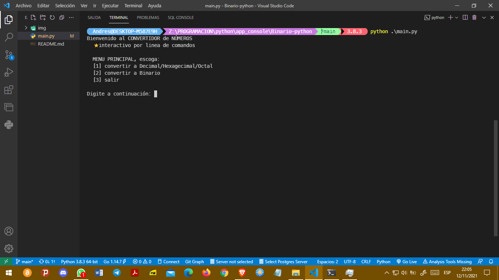
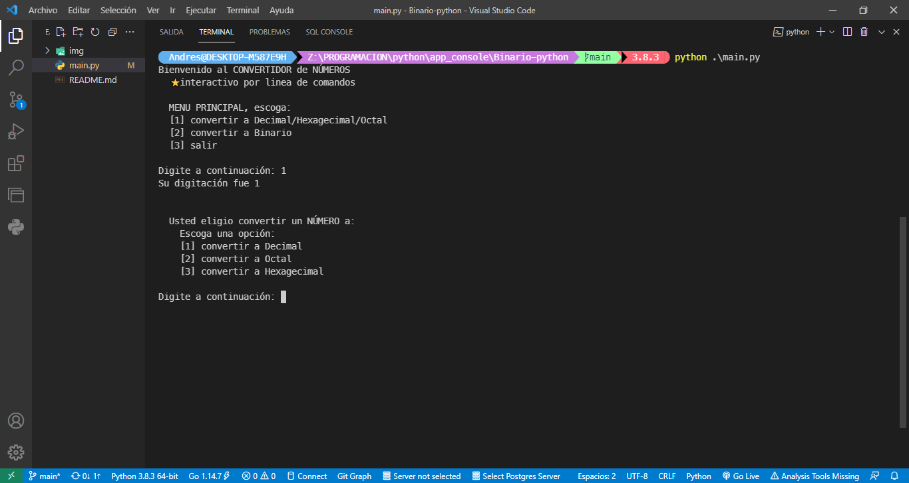
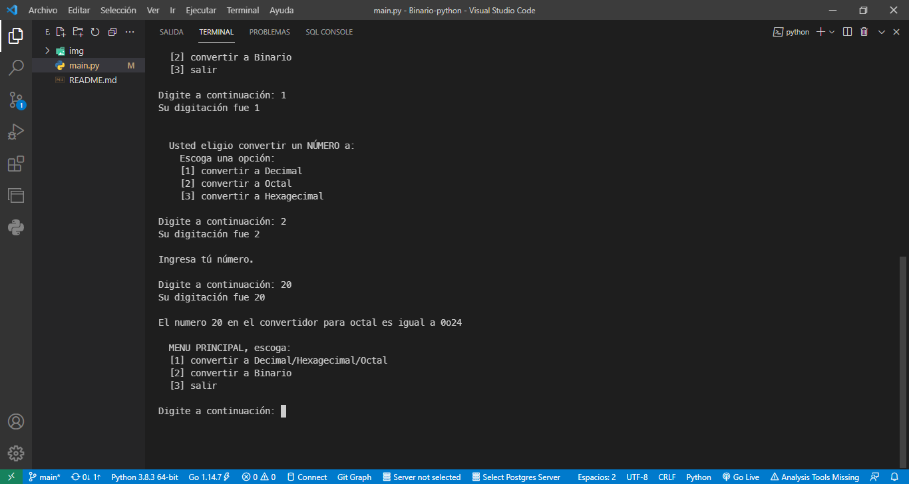
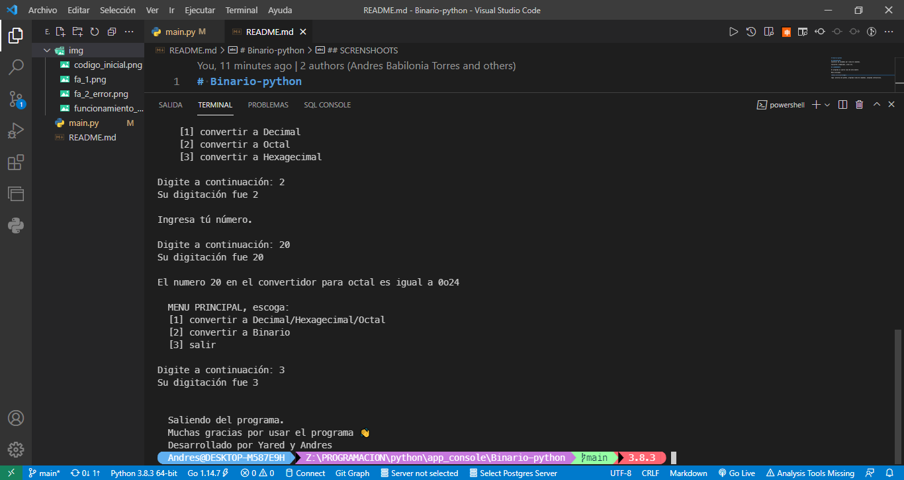

# Binario-python

## DESCRIPTION 
Conversor de unidades por linea de comandos.

Convierte a hedecimal, octal etc.

## SCRENSHOOTS

El programa al usarlo luce de esta manera

Menu principal.

tags: practica de python, programa linea de comandos. programa interactivos.
